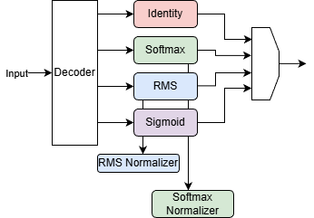
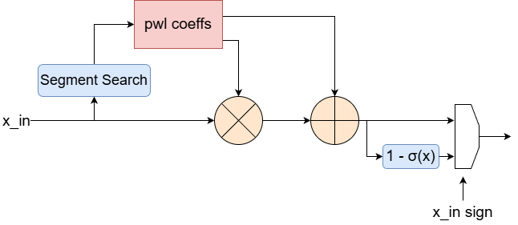
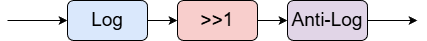

# function_eval_unit
hardware unit to perform multi function evaluation

# Function Evaluation Unit Design 

Multi function unit to compute functions used in LLM layers.  

# Sigmoid Unit 

To avoid the massive resource overhead of calculating true exponentials and floating-point divisions in RTL, this design utilizes a Piecewise Linear (PWL) approximation combined with domain reduction. By exploiting the inherent rotational symmetry of the sigmoid curve -where $\sigma(-x) = 1 - \sigma(x)$- the module evaluates only the absolute value of the input, effectively cutting the required Look-Up Table (LUT) memory in half and exploiting this reduction in double precision calculation of PWL segments.

# Square Root Calculation

Square Root unit is implemented using the Logarithmic Number System (LNS). This design bypasses the resource and latency hungry bottlenecks by converting the input data into the logarithmic domain, exploiting the mathematical property that a square root operation is simply a division by two: $\log_2(\sqrt{x}) = \frac{1}{2} \log_2(x)$. In binary hardware, this division is seamlessly executed as a zero-cost, single-bit right shift. 
